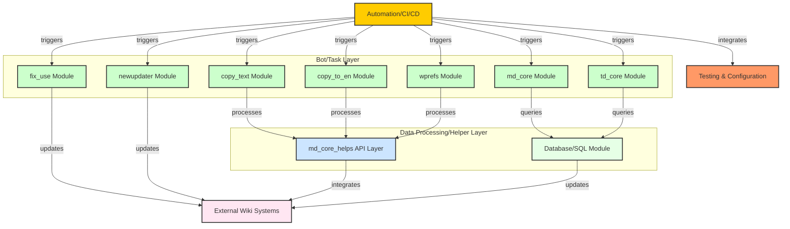

# MDWiki Automation Tool

## Overview

This project is a multi-module, bot-oriented automation tool primarily designed for interacting with the MediaWiki ecosystem. It consists of several self-contained Python packages (submodules) that perform various automated tasks. These tasks include copying text, updating references, processing markdown, interfacing with wiki APIs, and performing maintenance. The project emphasizes modularity, reusability, and testability, with a strong focus on automation through GitHub Actions.

## Architecture

The system is structured around several key components:

**1. Bot/Task Modules:**

* **`copy_text`**: Handles text copying operations between wiki pages.
* **`copy_to_en`**: Specifically designed for copying content to the English Wikipedia.
* **`fix_use`**: Focuses on fixing and maintaining the usage of templates or elements within wiki pages.
* **`md_core`**: Provides core functionalities for MediaWiki interactions, including submodules for adding references (`add_rtt`), fixing citation style 1 templates (`fix_cs1`), markdown processing (`mdpy`), and generating statistics (`stats`).
* **`td_core`**: Contains tools for translation-related tasks, such as copying data after translation (`after_translate`), copying data (`copy_data`), and counting markdown elements (`mdcount`).
* **`wprefs`**: Manages wiki preferences and settings, providing API interactions and bot functionalities.
* **`newupdater`**: Facilitates updates and modifications to wiki pages, potentially involving specific update scripts.

Each of these modules contains one or more "bots" (scripts within the `bots` directories or files named `bot.py`) that are responsible for executing specific automation tasks.

**2. Helper and Core Libraries:**

* **`md_core_helps`**: Provides shared functions and integrations, particularly for interacting with MediaWiki APIs and SQL databases. This module is crucial for the other bot modules to perform their tasks effectively.

**3. Testing & Validation:**

* Each major module includes a `tests` directory containing Python files (e.g., `tests.py`) that implement unit and integration tests. This highlights the project's commitment to ensuring the reliability and correctness of its operations.

**4. Configuration & CI/CD:**

* **`.github/workflows`**: Contains GitHub Actions workflow files (`d.yml`, `snorkell-auto-documentation.yml`) that automate various aspects of the development lifecycle, such as continuous integration, testing, and potentially documentation generation.
* **Configuration Files**: Files like `.coderabbit.yaml`, `.pre-commit-config.yaml`, and `sweep.yaml` are used to configure code quality checks, pre-commit hooks, and other development tools, ensuring consistency and maintainability.

**5. External Services and APIs:**

* The bot modules interact with external systems to perform their tasks. These include:
    * **MediaWiki API**: Used to access and modify wiki content. The `md_core_helps/apis` directory contains modules like `mdwiki_api.py` and `wiki_api.py` that facilitate this interaction.
    * **WikiData**: Potentially used for accessing and integrating structured data. The `md_core_helps/apis` directory includes `wikidataapi.py`.
    * **SQL Databases**: Used for data storage and retrieval, as suggested by the presence of `sql.py` and `sqlviews.py`.

## System Design Diagram (Conceptual)

